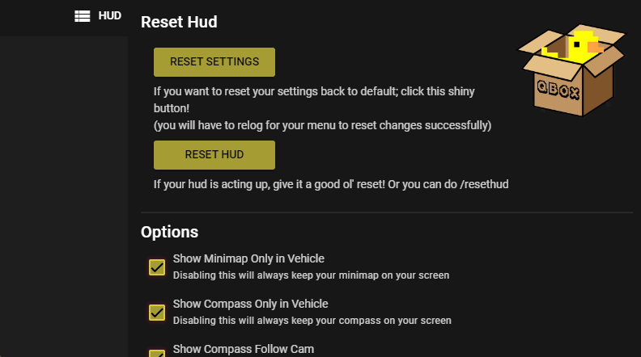
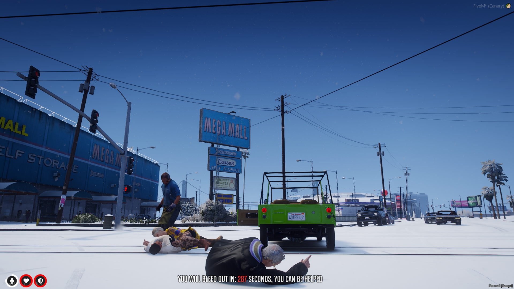
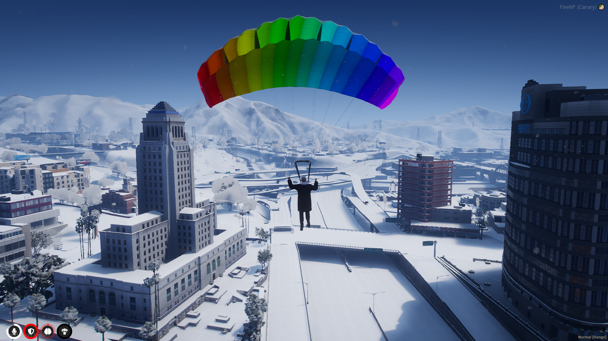
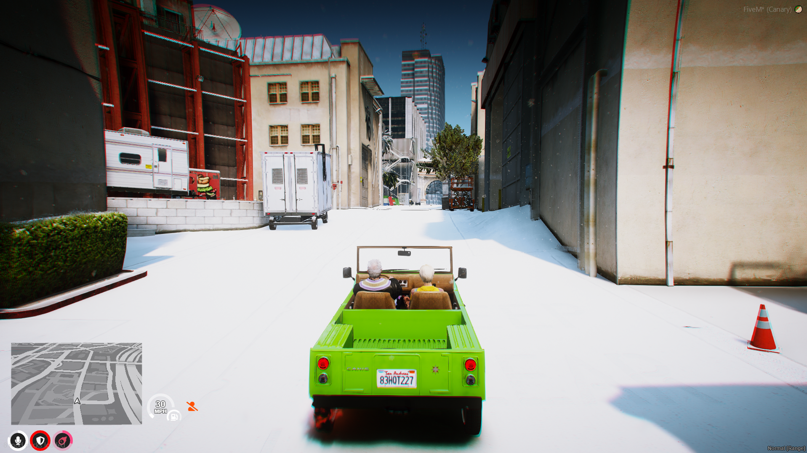
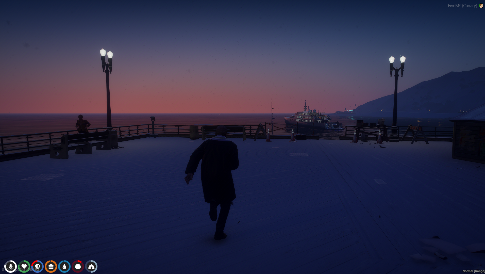
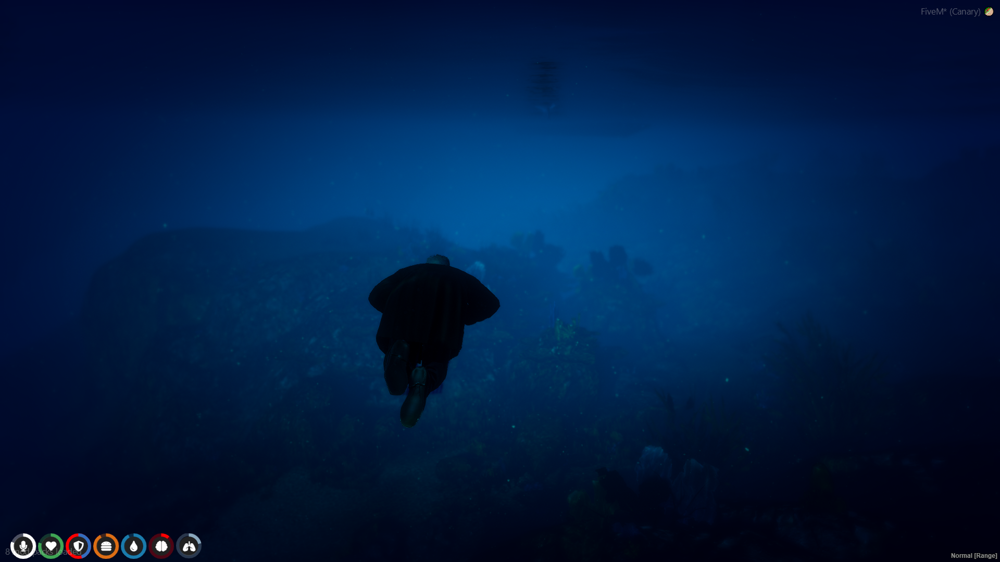

# Things you should know:
* To open the menu in-game the **default key** is **"I"** or you can type **"/menu"**
* Your settings will **always** be **stored locally**, so even if you delete the resource it **will** keep your current settings. The **only** way you can wipe the local storage sucessfully is by clicking the **"Reset Settings"** button on the in-game menu
(comes with new open menu sound, close menu sound, click menu sound)
* If you receive ```attempt to index a nil value (global 'Lang')``` in your F8 console, the fastest way you can fix that issue is by downloading a new version via txAdminRecipe but if you are unable to do that because of the progress you’ve made on your existing build; you’ll have to unfortunately go through and download each one from the GitHub which I do not recommend. Save yourself a lot of time and pain by just downloading the recipe!

# FAQ
##
**Q:** Why do my borders not align with the maps?

**A:** Most of the time it generally means your safezone is not set to default in your GTA settings. (Settings/Display/"Restore Defaults")
##

##
**Q:** How do I enable dev mode?

**A:** Simple! All you have to do is type /admin and navigate through the menu to the last section called "Developer Options" and inside there you should see "Dev Mode", this will keep you invincible and add a cool developer icon in your circles/radials
##

##
**Q:** What does the purple circle/radial do?

**A:** That is your harness indicator! When you have the item "harness" in your inventory and while in a vehicle it will appear. Also, when you use your item "harness", the circle/radial will reflect the amount of uses left and decrease overtime.
##

# Previews
### menu config (this is just a preview more options included than what is shown here)

### all radials

### dead health

### engine health

### altitude

### parachute

### armed

### cinematic

### cruise

### harness

### cash

### bank

### nitro

### stamina

### oxygen

### radio (outdated color)

